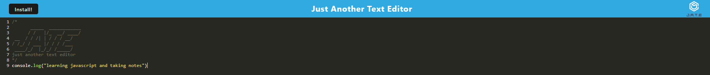

# TextEditor

 
 

 
 

## Table of Contents

- Description
- Links
- Installation
- Dependencies
- Contributors
- Contact me  

## Description

This project is designed to provide a text editor to take notes with javascript coloring. you then can download the application and through local storage and PWA usage can access the information you previously had up as well as be accessible without internet connection

## Links

Link to Heroku deployed site: <a href="https://pure-island-75813.herokuapp.com/" target="_blank">JATE TEXT EDITOR</a>  
Link to Github Repo: <a href="https://github.com/Konado22/newTextEditor" target= "_blank"> GITHUB REPO</a>

## Dependencies

to acquire needed dependencies please run ""npm i"" or ""npm install""

## Contributors

- Konado22 (myself)

## Contact Me

please submit any issues to my github or contact me at my email address: jessedraper2@gmail.com
